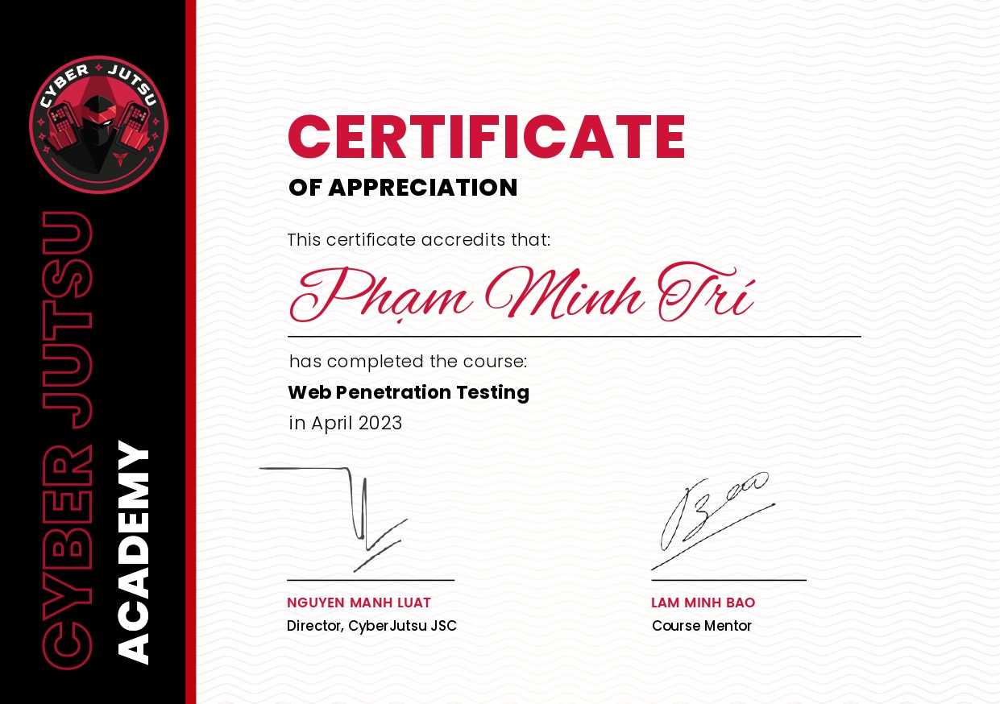

1. **Cyber Jutsu Web Pentest**  
   **Issued by**: Cyber Jutsu Academy

   **Date**: April 2023

   **Description**: This certificate acknowledges that Phạm Minh Trí has successfully completed the Web Penetration Testing course, demonstrating proficiency in identifying and exploiting vulnerabilities in web applications. The course covered various essential techniques and tools used in web security.

   **Signatories**:
   - Nguyen Manh Luat, Director, Cyber Jutsu JSC
   - Lam Minh Bao, Course Mentor

   

---
